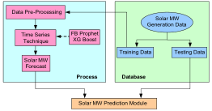
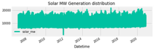
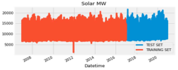
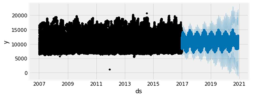
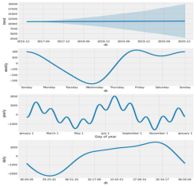
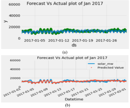
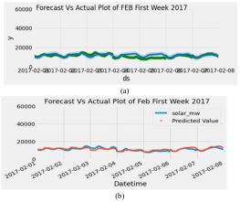

# Time Series Forecasting of Solar Power Generation Using Facebook Prophet and XG Boost

Rahul Gupta Department of Electrical Engineering, NSUT, New Delhi, 110078, India. E-mail: rahul.ee20@nsut.ac.in

Anil Kumar Yadav Department of Electrical Engineering, NIT Hamirpur, Hamirpur (H.P.) 177005, India. E-mail: anilei007@gmail.com

SK Jha Department of ICE, NSUT, New Delhi, 110078, India. E-mail: skjha@nsut.ac.in

Pawan Kumar Pathak School of Automation, Banasthali Vidyapith, Rajasthan, 304022, India. E-mail: ppathak999@gmail.com

Abstract — In recent years solar energy penetration in local grids is increasing, resulting in a reduction in reliability, so smart grid planning is required to improve grid reliability and leverage the grid's capabilities. Due to the increasing, no of solar power plants, day by day in the energy sector, and reduction of dependency on fossil fuels, prediction of solar power generation is necessary for future planning for smart grid integration. Forecasting techniques are employed to tackle a wide range of problems, such as renewable energy generation, electric load and price, demand-side management, the financial & banking sector, healthcare, stock market, and cyberspace security prediction, etc. In the time-series dataset, there is information related to the time that can be used to predict and analyze data. Machine Learning algorithms such as Facebook (FB) Prophet and Extreme Gradient Boost (XGB) are used for predicting solar energy generation on a monthly and weekly basis. From this proposed research, it concluded that the XGB model is efficient to forecast in terms of better prediction and better fitting than the FB prophet model. RMSE, MAPE, and MAE parameters are calculated to check the performance of the time series model.

Keywords — Time series forecasting, Facebook Prophet, XG Boost

## I. Introduction NTRODUCTION

A NY data recorded with some fixed time interval of time is known as time-series data. This fixed interval can be on an hourly, daily, monthly or yearly basis, e.g. hourly temp reading, daily changing fuel prices, monthly electricity bill and annual company profit report etc. In time series data, time will always be independent variable and there can be one or many dependent variable. The objective of time series analysis is to understand how change in time affects the dependent variables and accordingly predict values for future time intervals. In light of the widespread use of renewable energy sources and distributed generation, there is an ever-increasing interest in integrating solar power into utility grids. The current power grid is being disrupted by a vast number of distributed and intermittent energy systems. This effectively transforms the passive, unidirectional grid into an active, bidirectional, and intelligent grid. A growing number of devices and systems are continuously connected to participants in the power grid. Consequently, the smart grid generates and exchanges massive amounts of data between different entities. This data can be very useful for the researchers and technocrats for the prediction applications in smart grid with the integration of renewable sources after preprocessed and analyzed.

Under the Ministry of New and Renewable Energy (MNRE), the Government of India has taken steps to establish solar energy projects that will supply electricity at a low cost,

reach remote areas, reduce dependence on conventional power sources, and reach out to rural areas [1] . In June 2020, solar energy had an installed capacity of 35 GW in India and would reach 100 GW by 2022. The solar mw generation profile is not fixed due to rapid changes in atmosphere conditions which leads to grid integration issues. In order to avoid this issue, there is a need of accurate solar power generation information to balance between the power generation and utilities and grid [2, 3] . As a result, a suitable day-ahead forecast model of solar power is necessary for optimal PV-based grids, as introduced in [4, 5] . In this paper, we have obtained time series data of solar MW generation, which work as an input. XGB and a Facebook Prophet technique are used to predict accurate solar MW output and compare results in terms of MAPE, MSE and MAE. For predicting the solar MW generation, time-series data is collected from online sources, and the test results forecasted by Machine Learning (ML) algorithms such as XGB and FB Prophet are mutually compared.

## II. LITERATURE REVIEW

In this paper, a multivariate regression method is introduced for the forecasting of daily output power in a grid-connected PV system [6] . Support vector machine, time series techniques like ARIMA and LSTM techniques for PV power prediction is discussed in [7-9] . Deep convolution neural network for the day ahead solar power forecasting is described in [10] . Prediction of 100kW PV plant output power is discussed by using FB prophet and ARIMA model [11] . Deep learning-based convolutional neural network and long short term memory network model for predicting solar irradiance is delineated in [12] . For the proper integration of renewable energy sources into the smart grid and due to the variable nature of renewable energy generation systems, forecast measures are helpful for smart grid infrastructure planning. For sequential data analysis, LSTM network model for PV power forecasting is described in [13] . This paper presents a solar irradiance prediction from a few hours to two days by using machine learning techniques [14] . ANN, DL, SVM and k-NN algorithms are presented in this study to predict the global solar irradiance [15] . An innovative technique of forecasting solar power generation is introduced using the least absolute shrinkage and selection operator (LASSO) to achieve high accuracy [16] . A novel PV forecasting technique done by PV cell temperature and their irradiance components modelling is presented in [17] . A

978-1-6654-5883-2/22/$31.00 c2022 IEEE

2022 IEEE Delhi Section Conference (DELCON) | 978-1-6654-5883-2/22/$31.00 €2022 IEEE | DOI: 10.1109/DELCON54057.2022.9752916

---

study of PV power generation forecasting and nowcasting is done by using neural networks and machine learning algorithms [18-20] . An extensive review of PV power forecasting at different time intervals is elaborated in [21] . Short term forecasting of PV power output using SVM algorithm is proposed to predict output power in [22, 27] .

## III. Material ATERIAL and Methods ETHODS

In this study, the general process is followed for the prediction of solar power generation. Fig. 1 shows the flowchart of the solar MW prediction module. The dataset is initially divided into training and testing data. Further, the data is preprocessed before training, and then the time series techniques such as FB prophet and XGBoost are selected for the solar power consumption in future.

Fig. 1. Flowchart of Solar MW Prediction Module

### A. Data Preparation

Data Collection: Time series forecasting of solar energy dataset is collected from Kaggle repository [23] . In this paper, univariate analysis by considering only one dependent variable, i.e. solar-MW for the proposed dataset, is done. The objective of this research work is to do the univariate time series analysis of solar power generation data and subsequently forecast the amount of solar energy generated in future. The dataset consists of the data for the period from 5 Jan 2007 to 8 Mar 2020, which comprises 1, 16,117 rows and 8 columns. The features of this data are Datetime, solarMW, wind-direction, wind-speed, humidity, average windspeed, average pressure and temperature. Only a single feature is considered for the time series forecasting, i.e. solar-MW. The solar-MW generation data is distributed against year, as shown in Fig. 2 .

Fig. 2. Historical Data Distribution of solar power generation data

Data preprocessing: Data preprocessing is a process of preparing the raw data and making it suitable for the machine learning model. Missing values in a dataset are cleaned or

dropped from the data for enhancing the performance. In this paper, it is required to prepare the dataset and create a data frame with two columns out of which one column contains the time information represented as `ds' (datestamp), and another column contains the feature represented as `y', which is target variable -`solar-MW' as given in TABLE I . Feature scaling, such as normalization or standardization, can be used for fast execution of code and better prediction. The proposed model is then trained on the dataset.

TABLE I: Solar MW generation (ds and y)

<table><tr><td></td><td>ds</td><td>y</td></tr><tr><td>0</td><td>2017-01-01</td><td>12792</td></tr><tr><td>1</td><td>2016-12-31</td><td>13140</td></tr><tr><td>2</td><td>2016-12-31</td><td>13454</td></tr><tr><td>3</td><td>2016-12-31</td><td>13759</td></tr><tr><td>4</td><td>2016-12-31</td><td>13987</td></tr></table>

Exploratory Data Analysis: This step is used for analyzing and investigating the dataset and summarizing its main characteristics by employing visualization methods. The primary purpose of this step is to find the pattern that exists in a dataset.

Performance Matrices: In order to check the performance of the proposed models, some evaluation metrics such as mean squared error (MSE), mean absolute error (MAE) and mean absolute percentage error (MAPE) is computed. These metrics are imported from the Scikitlearn library of the python framework.

$$ M S E  = \frac { 1 } { N } \sum _ { t } ( o t - P t ) ^ { 2 }$$

$$MAE=\frac{1}{N} \sum_{t}(O t-P t)$$

$$ MAPE  = \frac { 1 } { N } \sum _ { t } ^ { o t - p t } \frac { \partial t } { \partial t }$$

where, O = original data, P = predicted data, N= number of times summation iteration.

### B. Model Selection

Facebook Prophet Model: The prophet is a procedure for forecasting time series data based on an additive model where non-linear trends are fitted on the basis of yearly, weekly, daily seasonality and holiday effects [24] . It works best with the time series that have strong seasonal effects and several season-wise historical data. The prophet is a robust method for handling the missing data and outliers apart from predicting the shifts in the trend. The prophet is open source software released by Facebook's Core Data Science team. Prophet is Facebook's open-source tool for making timeseries predictions. This FB prophet forecasting utilizes the additive regression model $y(w)$ as given in (1) below.

$$y ( w ) = g ( w ) + s ( w ) + h ( w ) + e ( w ) \quad ( 1 )$$

where, $y(w)$ is the additive regressive model, $g(w)$ is the trend factor, $s(w)$ is the seasonality factor, $h(w)$ is the holiday factor, and $e(w)$ is the error factor. All these factors are illustrated as below.

---

Trend: Trend represents the change in dependent variables with respect to time from start to end. In case of an increasing trend, the dependent variable will increase with time and vice versa. It is not necessary to have a definite trend in time series. It can have either an increasing or decreasing trend for time series data. In short, the trend represents the varying mean of time series data.

Seasonability: If observations repeat after a fixed time interval, they are referred to as seasonal observations. These seasonal changes in data can occur because of natural events or man-made events. For example, every year, warm clothes sales increase just before the winter season. So seasonality represents the data variations at fixed intervals.

Holiday effect: It occurs on an irregular schedule, either for one day or a couple of days.

Error: It represents information for any unusual changes that was not reflected in the model.

XG Boost Model: Data Science is gaining increasing importance across many fields in the last decade. The extreme gradient boosting (XGBoost) model has become a popular tool for many applications. In these days, big data and artificial intelligence is becoming more popular. Boosting methods are progressing day by day with time. In many real-world applications, a well-known technique of boosting like XGB gives a good result for the prediction of classification and regression problems. It is a perfect combination of hardware and software optimization techniques that gives accurate results with the least computation time. It follows the innovative gradient boosted decision tree-based searching method [25, 26] . The objective function of XG Boost model on the $w^{\text{th}}$ iteration as evaluated in (2) below.

$$Z ^ { ( w ) } = \sum _ { i = 1 } ^ { n } z ( f _ { i } , \hat { f } _ { i } ( w - 1 ) + g _ { w } ( r _ { i } ) ) + \partial ( g _ { w } ) \quad ( 2 )$$

where, $z$ is the loss function, $g_w$ is the $w^{\text{th}}$ tree output and $\partial$ is the regularization.

## IV. Experimental XPERIMENTAL Results ESULTS and Discussion ISCUSSION

The time series dataset is processed through the two techniques for solar power prediction. The entire dataset used for the solar-MW prediction is splitted into training and testing datasets. The dataset from 5 JAN 2007 to 1 JAN 2017 is used for training purposes, and from 1 JAN 2017 to 8 Mar 2020 is used for testing purposes as depicted in Fig 3 . Then the model is trained, and the performance is checked by the parameters MAE, MSE & % MAPE at each time step. This study gives the predictions of the solar power generation for future 24 months as shown in Fig. 4 . In order to clearly understand the predicted values, actual values and forecast errors, a forecast plot is made, as shown in Fig. 4 . In this plot, the black dot shows the actual values, the blue line represents the forecasted values up to 2021, and the blue shaded area shows the forecasted error. This model prediction plot generates a component plot in terms of an

individual component such as trend, weekly, yearly and daily seasonality components of solar power generation are shown in Fig. 5 .

Fig. 3. Division of Training and testing dataset

Fig. 4. Forecast plot of solar power generation

Fig. 5. Daily, yearly and weekly component plot of solar power generation

It shows a better illustration of the forecasted model. The trend component represents the pattern of solar power generation. The weekly component plot shows that the highest solar power is used during weekends than that on weekdays; yearly component plot shows that the same is being used between July to September, and for days it is used in the evening.

### A. Monthly Prediction

After testing the model, the prediction for a monthly plot of January 2017 is obtained and shown in Fig. 6 (a) and (b) using FB Prophet and XGB algorithm. In Fig. 6(a) , the green dot indicates the forecast values, and the blue dot represents the actual generation values using FB Prophet model. In Fig.

---

6(b), the red dot indicates the forecast values, and the blue dot represents the actual generation values using XGBoost.

Fig. 6. Monthly Prediction (a) Forecast vs. Actual plot of Solar MW of month JAN 2017 using FB prophet, and (b) Forecast vs Actual plot of Solar MW of month JAN 2017 using XGB

Fig. 7. Weekly Prediction (a) Forecast Vs. Actual of first week of JAN 2017 using FB prophet, and (b) Forecast Vs Actual of first week of JAN 2017 using XGB prophet

### B. Weekly Prediction

The forecast versus actual plot of the first week of Feb 2017 is shown in Fig. 7 . Fig. 7 (a) represents the plot of solar MW generation in the first week of Feb 2017 using FB prophet, and Fig. 7 (b) represents the same by XGB model. Forecasting solar power generation is an onerous task because it is stochastic in nature. In this study, it is predicted by FB Prophet and XGB model. The performances of the models are checked by the following parameters such as MSE, MAE and MAPE, respectively, in TABLE II .

TABLE II: Evaluation parameters of proposed algorithm

<table><tr><td>Model</td><td colspan="3">Performance Metrics</td></tr><tr><td></td><td>MSE</td><td>MAE</td><td>%MAPE</td></tr><tr><td>FB Prophet</td><td>8440621.416</td><td>2371.27903963</td><td>21.846587495320</td></tr><tr><td>XG Boost</td><td>2900829.114</td><td>1265.99691889</td><td>10.953978666291</td></tr></table>

As it can be seen that the XGB outperforms the FB Prophet in terms of %MAPE as it gives the lowest percentage error. The performance results demonstrate that the proposed XG Boost has significant improvement in terms of MSE and MAE.

## V. Conclusion ONCLUSION

For power quality improvement and stable power supply into the grid, there is a need for accurate prediction of solar power generation. This paper proposes two ML methods such as Facebook Prophet and XGB, for solar power prediction. The XGB model fits better with the dataset as compared to FB prophet model. Due to the high seasonality in dataset, XGB and Facebook Prophet handle the large data effectively. In future work, a deep learning technique which may handle a large amount of data will be used to improve the prediction error. A shorter duration of solar power generation data could also be used for further improvement of results.

## REFERENCES

[1] Bansal, M., Kumar, A., and Virmani, A "Green IoT: Current Scenario & Future Prospects". Journal of trends in Computer Science and Smart technology (TCSST), vol. 2, no.4, pp.173-180, 2020.

[2] Shah, R., Mithulananthan, N., Bansal, R. C., & Ramachandranzurthy, V. K. "A review of key power system stability challenges for large-scale PV integration", Renewable and Sustainable Energy Reviews, vol. 41, pp.1423-1436, 2015.

[3] Hossain, E., Hossain, J., & Un-Noor, F. "Utility grid: Present challenges and their potential solutions". IEEE Access, vol.6, pp. 60294-60317, 2018.

[4] Agoua, X. G., Girard, R., & Kariniotakis, G. "Short-term spatiotemporal forecasting of photovoltaic power production". IEEE Transactions on Sustainable Energy, vol.9, no.2, pp.538-546, 2017.

[5] Nespoli, A., Ogliari, E., Leva, S., Massi Pavan, A., Mellit, A., Lughi, V., & Dolara, A. "Day-ahead photovoltaic forecasting: A comparison of the most effective techniques" Energies, vol.12, no. 9, pp.1621, 2019.

[6] Li, Y., He, Y., Su, Y., & Shu, L. (2016). "Forecasting the daily power output of a grid-connected photovoltaic system based on multivariate adaptive regression splines". Applied Energy, no.180, pp. 392-401, 2016.

[7] Malvoni, M., De Giorgi, M. G., & Congedo, P. M. (2016). "Data on Support Vector Machines (SVM) model to forecast photovoltaic power". Data in brief, vol. 9, pp. 13-16, 2016.

[8] Pathak, P. K., Yadav, A. K., & Alvi, P. A. (2020). Advanced solar MPPT techniques under uniform and non-uniform irradiance: a comprehensive review. Journal of Solar Energy Engineering, 142 (4), 040801.

[9] S. Siami-Namini, N. Tavakoli, and A. Siami Namin, "A Comparison of ARIMA and LSTM in Forecasting Time Series," in Proceedings - 17th IEEE International Conference on Machine Learning and Applications, ICMLA pp. 1394–1401,Dec2018

[10] Zang, H., Cheng, L., Ding, T., Cheung, K. W., Wei, Z., & Sun, G. "Day-ahead photovoltaic power forecasting approach based on deep convolutional neural networks and meta learning". International Journal of Electrical Power & Energy Systems, vol.118, pp.105790,Jun2020

[11] Ananthu, D. P., & Neelashetty, K. (2021, April). "A study of 100kWp PV Plant Output Power Forecasting: A case study"

---

In 2021 5th International Conference on Computing Methodologies and Communication (ICCMC),pp. 723-728 IEEE, 2021.

[12] Wang, F., Yu, Y., Zhang, Z., Li, J., Zhen, Z., & Li, K. "Wavelet decomposition and convolutional LSTM networks based improved deep learning model for solar irradiance forecasting" applied sciences, vol.8, no.8, pp.1286, 2018.

[13] Husein, M., & Chung, I. Y. "Day-ahead solar irradiance forecasting for microgrids using a long short-term memory recurrent neural network: A deep learning approach" Energies, vol.12, no.10, pp.1856, 2019.

[14] Sharma, A., & Kakkar, A. "Forecasting daily global solar irradiance generation using machine learning". Renewable and Sustainable Energy Reviews, vol.82, pp. 2254-2269, Feb2018

[15] Ağbulut, Ö., Gürel, A. E., & Biçen, Y. " Prediction of daily global solar radiation using different machine learning algorithms: Evaluation and comparison" Renewable and Sustainable Energy Reviews, vol.135, pp.110114, 2021

[16] Tang, N., Mao, S., Wang, Y., & Nelms, R. M. "Solar power generation forecasting with a LASSO-based approach". IEEE Internet of Things Journal, vol.5, no.2,pp.1090-1099, Mar 2018.

[17] Wang, J., Zhong, H., Lai, X., Xia, Q., Wang, Y., & Kang, C. "Exploring key weather factors from analytical modeling toward improved solar power forecasting". IEEE Transactions on Smart Grid, vol.10, pp.2, pp.1417-1427, 2017.

[18] Oneto, L., Laureri, F., Robba, M., Delfino, F., & Anguita, D. “Data-driven photovoltaic power production nowcasting and forecasting for polygoneration microgrids.” IEEE Systems Journal, vol.12, no.3, pp. 2842-2853, 2017.

[19] Pathak, P. K., Yadav, A. K., & Alvi, P. A. A state-of-the-art review on shading mitigation techniques in solar photovoltaics via metaheuristic approach. Neural Computing and Applications , vol. 34, no.1, pp. 171-209, 2022.

[20] Pathak, P. K., Padmanaban, S., Yadav, A. K., Alvi, P. A., & Khan, B. Modified incremental conductance MPPT algorithm for SPV-based grid-tied and stand-alone systems. IET Generation, Transmission & Distribution, vol. 16, no. 4, pp. 776–791, 2022.

[21] Antonanzas, J., Osorio, N., Escobar, R., Urraca, R., Martinez-dePison, F. J., & Antonanzas-Torres, F. "Review of photovoltaic power forecasting." Solar energy, vol.136, pp.78-111, 2016.

[22] Li, L. L., Wen, S. Y., Tseng, M. L., & Wang, C. S. "Renewable energy prediction: A novel short-term prediction model of photovoltaic output power" Journal of Cleaner Production, vol. 228, pp.359-375, 2019.

[23] https://www.kaggle.com/chaitanyakumar12/time-series forecastingof-solar-energy

[24] Taylor, S. J., & Letham, B. (2017). Forecasting at scale. 2017

[25] Chen, T., He, T., Benesty, M., Khotilovich, V., Tang, Y., Cho, H., & Li, Y. xgboost: Extreme gradient boosting. R package version 0.90, 2019.

[26] Al-Rakhami, M., Gumaei, A., Alsanad, A., Alamri, A., & Hassan, M. M., “An ensemble learning approach for accurate energy load prediction in residential buildings.” IEEE Access, vol.7, pp.4832848338.,Apr2019

[27] Pathak, P. K., Yadav, A. K., & Tyagi, P., "Design of three phase grid tied solar photovoltaic system based on three phase VSI," In 2018 8th IEEE India International Conference on Power Electronics (IICPE), pp. 1-6, 2018.

